# Chương 2. PHÂN TÍCH THIẾT KẾ HỆ THỐNG

## 2.1 Biểu đồ Use Case

Từ yêu cầu chức năng của hệ thống SenpaiAI - Japanese Learning Assistant, ta xây dựng biểu đồ use case như sau.

### 2.1.1 Các tác nhân

| STT | Tác nhân | Tác động với hệ thống |
|-----|----------|----------------------|
| 1 | **User** | - **Authentication**: Đăng ký, đăng nhập, đăng xuất tài khoản - **Manage Profile**: Quản lý thông tin cá nhân, cập nhật trình độ JLPT, mục tiêu học tập - **Chat with AI**: Gửi câu hỏi và nhận phản hồi từ AI về tiếng Nhật - **Grammar Analysis**: Phân tích ngữ pháp tiếng Nhật trong văn bản - **Translation**: Dịch văn bản giữa tiếng Nhật và tiếng Việt - **JLPT Prediction**: Dự đoán trình độ JLPT của văn bản - **Manage Learning Library**: Xem, tìm kiếm, thêm, sửa, xóa tài liệu học tập - **View Learning History**: Xem lịch sử chat và các phiên học tập - **View Statistics**: Xem thống kê tiến độ học tập - **Export Data**: Xuất dữ liệu học tập - **Reset Progress**: Đặt lại tiến độ học tập - **Delete Account**: Xóa tài khoản |

### 2.1.2 Các ca sử dụng

#### 🔐 Authentication
- **Mô tả**: Cho phép người dùng đăng ký tài khoản mới, đăng nhập vào hệ thống, và đăng xuất.
- **Tác nhân tương tác**: User

#### 👤 Manage Profile
- **Mô tả**: Quản lý thông tin cá nhân, cập nhật trình độ JLPT hiện tại, thiết lập mục tiêu học tập.
- **Tác nhân tương tác**: User

#### 💬 Chat with AI
- **Mô tả**: Gửi câu hỏi về tiếng Nhật và nhận phản hồi từ AI với RAG (Retrieval-Augmented Generation), bao gồm ngữ cảnh từ tài liệu học tập.
- **Tác nhân tương tác**: User

#### 📖 Grammar Analysis
- **Mô tả**: Phân tích văn bản tiếng Nhật để xác định các điểm ngữ pháp, đánh giá trình độ JLPT, và đưa ra gợi ý học tập.
- **Tác nhân tương tác**: User

#### 🔄 Translation
- **Mô tả**: Dịch văn bản giữa tiếng Nhật và tiếng Việt với độ chính xác cao.
- **Tác nhân tương tác**: User

#### 🎯 JLPT Level Prediction
- **Mô tả**: Dự đoán trình độ JLPT (N5-N1) của văn bản tiếng Nhật dựa trên độ phức tạp từ vựng, ngữ pháp và kanji.
- **Tác nhân tương tác**: User

#### 📚 Manage Learning Library
- **Mô tả**: Quản lý thư viện tài liệu học tập, bao gồm xem, tìm kiếm ngữ nghĩa, thêm, sửa, xóa tài liệu.
- **Tác nhân tương tác**: User

#### 📊 View Learning History
- **Mô tả**: Xem lịch sử các cuộc trò chuyện với AI, tìm kiếm trong lịch sử, và xóa lịch sử.
- **Tác nhân tương tác**: User

#### 📈 View Statistics
- **Mô tả**: Xem thống kê về tiến độ học tập, số lượng tài liệu đã học, và các chỉ số khác.
- **Tác nhân tương tác**: User

#### 💾 Export Data
- **Mô tả**: Xuất dữ liệu học tập (lịch sử chat, tài liệu, thống kê) ra file HTML để lưu trữ hoặc in.
- **Tác nhân tương tác**: User

#### 🔄 Reset Progress
- **Mô tả**: Đặt lại tiến độ học tập, xóa lịch sử chat và các dữ liệu liên quan.
- **Tác nhân tương tác**: User

#### 🗑️ Delete Account
- **Mô tả**: Xóa tài khoản và tất cả dữ liệu liên quan của người dùng.
- **Tác nhân tương tác**: User

### 2.1.3 Biểu đồ Use Case

#### Biểu đồ Use Case tổng quát

```mermaid
graph TB
    User[👤 User]
    
    UC1[🔐 Authentication]
    UC2[👤 Manage Profile]
    UC3[💬 Chat with AI]
    UC4[📖 Grammar Analysis]
    UC5[🔄 Translation]
    UC6[🎯 JLPT Prediction]
    UC7[📚 Manage Learning Library]
    UC8[📊 View Learning History]
    UC9[📈 View Statistics]
    UC10[💾 Export Data]
    UC11[🔄 Reset Progress]
    UC12[🗑️ Delete Account]
    
    User --> UC1
    User --> UC2
    User --> UC3
    User --> UC4
    User --> UC5
    User --> UC6
    User --> UC7
    User --> UC8
    User --> UC9
    User --> UC10
    User --> UC11
    User --> UC12
    
    style User fill:#4A90E2,stroke:#2E5C8A,color:#fff
    style UC1 fill:#E8F4F8,stroke:#4A90E2
    style UC2 fill:#E8F4F8,stroke:#4A90E2
    style UC3 fill:#E8F4F8,stroke:#4A90E2
    style UC4 fill:#E8F4F8,stroke:#4A90E2
    style UC5 fill:#E8F4F8,stroke:#4A90E2
    style UC6 fill:#E8F4F8,stroke:#4A90E2
    style UC7 fill:#E8F4F8,stroke:#4A90E2
    style UC8 fill:#E8F4F8,stroke:#4A90E2
    style UC9 fill:#E8F4F8,stroke:#4A90E2
    style UC10 fill:#E8F4F8,stroke:#4A90E2
    style UC11 fill:#E8F4F8,stroke:#4A90E2
    style UC12 fill:#E8F4F8,stroke:#4A90E2
```

**Hình 2.1 Biểu đồ Use Case tổng quát**

#### Biểu đồ Use Case Authentication

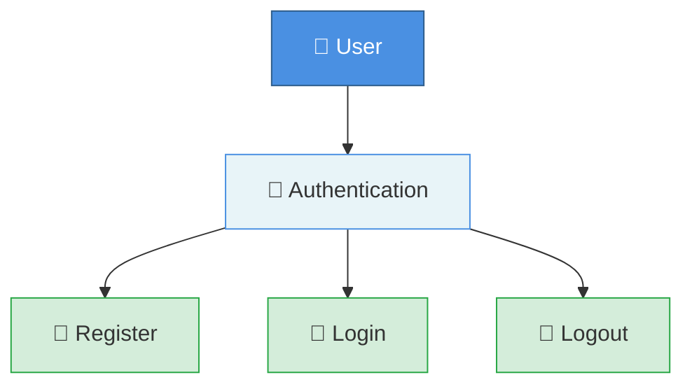
```mermaid
graph TB
    User[👤 User]
    
    UC1[🔐 Authentication]
    UC1_1[📝 Register]
    UC1_2[🔑 Login]
    UC1_3[🚪 Logout]
    
    User --> UC1
    UC1 --> UC1_1
    UC1 --> UC1_2
    UC1 --> UC1_3
    
    style User fill:#4A90E2,stroke:#2E5C8A,color:#fff
    style UC1 fill:#E8F4F8,stroke:#4A90E2
    style UC1_1 fill:#D4EDDA,stroke:#28A745
    style UC1_2 fill:#D4EDDA,stroke:#28A745
    style UC1_3 fill:#D4EDDA,stroke:#28A745
```

**Hình 2.2 Biểu đồ Use Case Authentication**

#### Biểu đồ Use Case Manage Profile

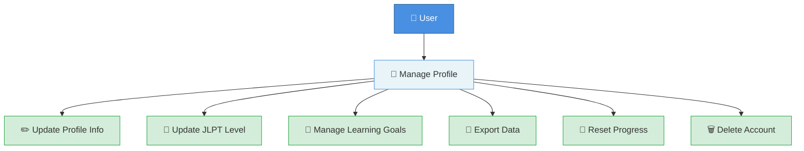
```mermaid
graph TB
    User[👤 User]
    
    UC2[👤 Manage Profile]
    UC2_1[✏️ Update Profile Info]
    UC2_2[🎯 Update JLPT Level]
    UC2_3[📝 Manage Learning Goals]
    UC2_4[💾 Export Data]
    UC2_5[🔄 Reset Progress]
    UC2_6[🗑️ Delete Account]
    
    User --> UC2
    UC2 --> UC2_1
    UC2 --> UC2_2
    UC2 --> UC2_3
    UC2 --> UC2_4
    UC2 --> UC2_5
    UC2 --> UC2_6
    
    style User fill:#4A90E2,stroke:#2E5C8A,color:#fff
    style UC2 fill:#E8F4F8,stroke:#4A90E2
    style UC2_1 fill:#D4EDDA,stroke:#28A745
    style UC2_2 fill:#D4EDDA,stroke:#28A745
    style UC2_3 fill:#D4EDDA,stroke:#28A745
    style UC2_4 fill:#D4EDDA,stroke:#28A745
    style UC2_5 fill:#D4EDDA,stroke:#28A745
    style UC2_6 fill:#D4EDDA,stroke:#28A745
```

**Hình 2.3 Biểu đồ Use Case Manage Profile**

#### Biểu đồ Use Case Chat with AI

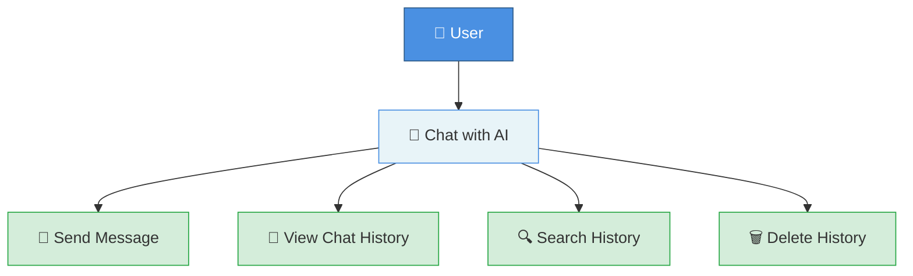
```mermaid
graph TB
    User[👤 User]
    
    UC3[💬 Chat with AI]
    UC3_1[💬 Send Message]
    UC3_2[📜 View Chat History]
    UC3_3[🔍 Search History]
    UC3_4[🗑️ Delete History]
    
    User --> UC3
    UC3 --> UC3_1
    UC3 --> UC3_2
    UC3 --> UC3_3
    UC3 --> UC3_4
    
    style User fill:#4A90E2,stroke:#2E5C8A,color:#fff
    style UC3 fill:#E8F4F8,stroke:#4A90E2
    style UC3_1 fill:#D4EDDA,stroke:#28A745
    style UC3_2 fill:#D4EDDA,stroke:#28A745
    style UC3_3 fill:#D4EDDA,stroke:#28A745
    style UC3_4 fill:#D4EDDA,stroke:#28A745
```

**Hình 2.4 Biểu đồ Use Case Chat with AI**

#### Biểu đồ Use Case Grammar Analysis

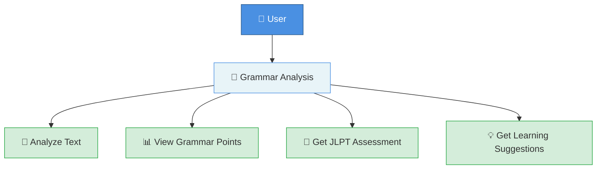
```mermaid
graph TB
    User[👤 User]
    
    UC4[📖 Grammar Analysis]
    UC4_1[📝 Analyze Text]
    UC4_2[📊 View Grammar Points]
    UC4_3[🎯 Get JLPT Assessment]
    UC4_4[💡 Get Learning Suggestions]
    
    User --> UC4
    UC4 --> UC4_1
    UC4 --> UC4_2
    UC4 --> UC4_3
    UC4 --> UC4_4
    
    style User fill:#4A90E2,stroke:#2E5C8A,color:#fff
    style UC4 fill:#E8F4F8,stroke:#4A90E2
    style UC4_1 fill:#D4EDDA,stroke:#28A745
    style UC4_2 fill:#D4EDDA,stroke:#28A745
    style UC4_3 fill:#D4EDDA,stroke:#28A745
    style UC4_4 fill:#D4EDDA,stroke:#28A745
```

**Hình 2.5 Biểu đồ Use Case Grammar Analysis**

#### Biểu đồ Use Case Manage Learning Library

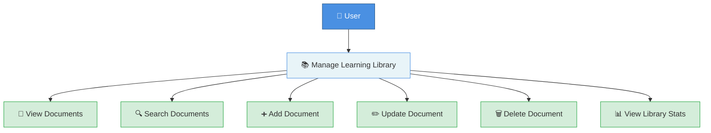
```mermaid
graph TB
    User[👤 User]
    
    UC7[📚 Manage Learning Library]
    UC7_1[👀 View Documents]
    UC7_2[🔍 Search Documents]
    UC7_3[➕ Add Document]
    UC7_4[✏️ Update Document]
    UC7_5[🗑️ Delete Document]
    UC7_6[📊 View Library Stats]
    
    User --> UC7
    UC7 --> UC7_1
    UC7 --> UC7_2
    UC7 --> UC7_3
    UC7 --> UC7_4
    UC7 --> UC7_5
    UC7 --> UC7_6
    
    style User fill:#4A90E2,stroke:#2E5C8A,color:#fff
    style UC7 fill:#E8F4F8,stroke:#4A90E2
    style UC7_1 fill:#D4EDDA,stroke:#28A745
    style UC7_2 fill:#D4EDDA,stroke:#28A745
    style UC7_3 fill:#D4EDDA,stroke:#28A745
    style UC7_4 fill:#D4EDDA,stroke:#28A745
    style UC7_5 fill:#D4EDDA,stroke:#28A745
    style UC7_6 fill:#D4EDDA,stroke:#28A745
```

**Hình 2.6 Biểu đồ Use Case Manage Learning Library**

### 2.1.4 Đặc tả ca sử dụng

#### Use Case: Authentication

- **Actors**: Người dùng (User)
- **Objective**: Đăng ký tài khoản mới, đăng nhập vào hệ thống, và đăng xuất
- **Pre-conditions**: 
  - Hệ thống đang hoạt động
  - Người dùng có kết nối internet
- **Post-conditions**: 
  - Người dùng đã đăng ký/đăng nhập thành công và có quyền truy cập hệ thống
  - JWT token được lưu trữ để xác thực các request tiếp theo
- **Description**:
  - **Register**: Người dùng nhập email, username, password để tạo tài khoản mới
  - **Login**: Người dùng nhập email/username và password để đăng nhập
  - **Logout**: Người dùng đăng xuất, xóa token khỏi localStorage

**Hoạt động của người dùng** | **Hoạt động của hệ thống**
---|---
Nhập thông tin đăng ký/đăng nhập | Validate dữ liệu, hash password, tạo JWT token
Gửi form | Lưu user vào database (register) hoặc xác thực (login)
Đăng xuất | Xóa token, chuyển về trang login

---

#### Use Case: Manage Profile

- **Actors**: Người dùng (User)
- **Objective**: Quản lý thông tin cá nhân và cài đặt học tập
- **Pre-conditions**: Người dùng đã đăng nhập vào hệ thống
- **Post-conditions**: Thông tin profile được cập nhật trong database
- **Description**:
  - **Update Profile Info**: Cập nhật username, email
  - **Update JLPT Level**: Chọn trình độ JLPT hiện tại (N5-N1)
  - **Manage Learning Goals**: Thêm, sửa, xóa mục tiêu học tập
  - **Export Data**: Xuất dữ liệu học tập ra file HTML
  - **Reset Progress**: Xóa lịch sử chat và đặt lại tiến độ
  - **Delete Account**: Xóa tài khoản và tất cả dữ liệu liên quan

**Hoạt động của người dùng** | **Hoạt động của hệ thống**
---|---
Cập nhật thông tin profile | Validate và lưu vào database
Thiết lập JLPT level | Cập nhật current_jlpt_level
Quản lý learning goals | Lưu mảng learning_goals
Xuất dữ liệu | Tạo file HTML với dữ liệu học tập
Đặt lại tiến độ | Xóa chat history, reset statistics
Xóa tài khoản | Xóa user và tất cả dữ liệu liên quan

---

#### Use Case: Chat with AI

- **Actors**: Người dùng (User)
- **Objective**: Gửi câu hỏi về tiếng Nhật và nhận phản hồi từ AI với RAG
- **Pre-conditions**: 
  - Người dùng đã đăng nhập
  - Ollama service hoặc OpenAI API đang hoạt động
  - Vector database (ChromaDB) đã có dữ liệu
- **Post-conditions**: 
  - Câu trả lời được hiển thị cho người dùng
  - Lịch sử chat được lưu vào database
- **Description**:
  - **Send Message**: Người dùng nhập câu hỏi, hệ thống:
    1. Tìm kiếm relevant documents từ vector DB (RAG)
    2. Inject context vào prompt
    3. Gọi LLM (Ollama/OpenAI) để generate response
    4. Extract grammar points nếu có
    5. Lưu vào chat history
  - **View Chat History**: Xem danh sách các cuộc trò chuyện trước đó
  - **Search History**: Tìm kiếm trong lịch sử chat
  - **Delete History**: Xóa một hoặc tất cả lịch sử chat

**Hoạt động của người dùng** | **Hoạt động của hệ thống**
---|---
Nhập câu hỏi và gửi | Tìm kiếm RAG context, gọi LLM, lưu vào database
Xem lịch sử chat | Truy xuất chat history từ database
Tìm kiếm trong lịch sử | Query database với search terms
Xóa lịch sử | Xóa records từ database

---

#### Use Case: Grammar Analysis

- **Actors**: Người dùng (User)
- **Objective**: Phân tích ngữ pháp tiếng Nhật trong văn bản
- **Pre-conditions**: 
  - Người dùng đã đăng nhập
  - LLM service đang hoạt động
- **Post-conditions**: Kết quả phân tích được hiển thị với grammar points, JLPT level, và suggestions
- **Description**:
  - **Analyze Text**: Người dùng nhập văn bản tiếng Nhật
  - **View Grammar Points**: Hiển thị các điểm ngữ pháp được tìm thấy với giải thích
  - **Get JLPT Assessment**: Đánh giá trình độ JLPT của văn bản (N5-N1)
  - **Get Learning Suggestions**: Đưa ra gợi ý học tập dựa trên phân tích

**Hoạt động của người dùng** | **Hoạt động của hệ thống**
---|---
Nhập văn bản tiếng Nhật | Gọi LLM với grammar analysis prompt
Xem kết quả phân tích | Parse JSON response, hiển thị grammar points
Xem JLPT assessment | Hiển thị jlpt_level từ kết quả
Xem learning suggestions | Hiển thị suggestions array

---

#### Use Case: Translation

- **Actors**: Người dùng (User)
- **Objective**: Dịch văn bản giữa tiếng Nhật và tiếng Việt
- **Pre-conditions**: 
  - Người dùng đã đăng nhập
  - LLM service đang hoạt động
- **Post-conditions**: Văn bản đã được dịch và hiển thị
- **Description**:
  - Người dùng nhập văn bản và chọn hướng dịch (JA→VI hoặc VI→JA)
  - Hệ thống gọi LLM với translation prompt
  - Kết quả dịch được hiển thị với confidence score

**Hoạt động của người dùng** | **Hoạt động của hệ thống**
---|---
Nhập văn bản và chọn hướng dịch | Gọi LLM với translation prompt
Xem kết quả dịch | Hiển thị translated_text và confidence

---

#### Use Case: Manage Learning Library

- **Actors**: Người dùng (User)
- **Objective**: Quản lý thư viện tài liệu học tập
- **Pre-conditions**: 
  - Người dùng đã đăng nhập
  - Vector database (ChromaDB) đang hoạt động
- **Post-conditions**: Tài liệu được thêm/sửa/xóa trong cả PostgreSQL và ChromaDB
- **Description**:
  - **View Documents**: Xem danh sách tất cả tài liệu với filter theo type, JLPT level
  - **Search Documents**: Tìm kiếm ngữ nghĩa trong vector database
  - **Add Document**: Thêm tài liệu mới (lưu vào PostgreSQL và embed vào ChromaDB)
  - **Update Document**: Cập nhật thông tin tài liệu
  - **Delete Document**: Xóa tài liệu khỏi cả hai database
  - **View Library Stats**: Xem thống kê số lượng tài liệu

**Hoạt động của người dùng** | **Hoạt động của hệ thống**
---|---
Xem danh sách tài liệu | Query PostgreSQL, hiển thị documents
Tìm kiếm tài liệu | Semantic search trong ChromaDB
Thêm tài liệu mới | Lưu vào PostgreSQL, split text, embed vào ChromaDB
Cập nhật tài liệu | Update PostgreSQL, re-embed vào ChromaDB
Xóa tài liệu | Xóa từ cả PostgreSQL và ChromaDB
Xem thống kê | Count documents từ database

---

## 2.2 Biểu đồ lớp (Class Diagram)

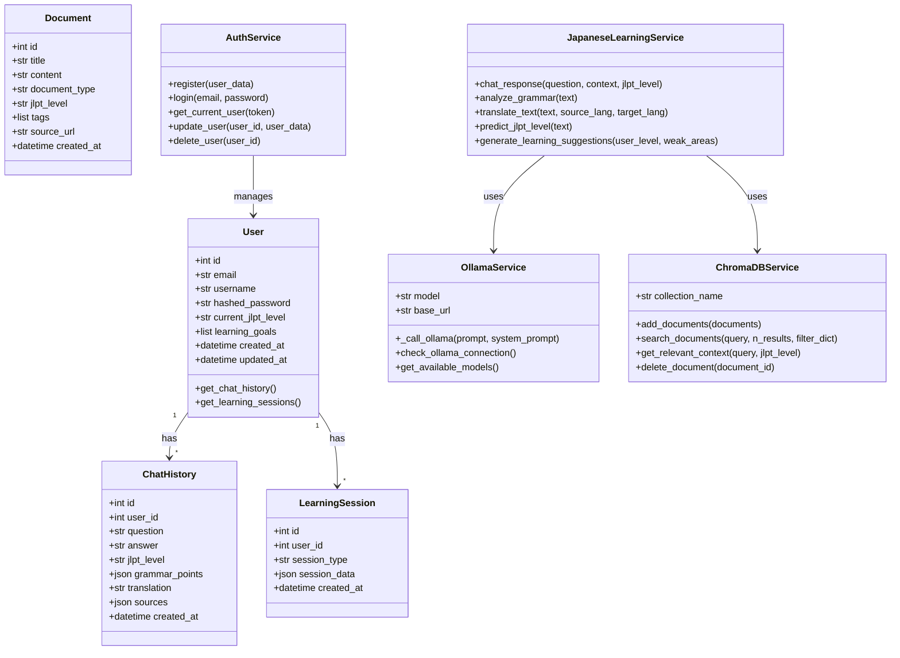
```mermaid
classDiagram
    class User {
        +int id
        +str email
        +str username
        +str hashed_password
        +str current_jlpt_level
        +list learning_goals
        +datetime created_at
        +datetime updated_at
        +get_chat_history()
        +get_learning_sessions()
    }
    
    class ChatHistory {
        +int id
        +int user_id
        +str question
        +str answer
        +str jlpt_level
        +json grammar_points
        +str translation
        +json sources
        +datetime created_at
    }
    
    class Document {
        +int id
        +str title
        +str content
        +str document_type
        +str jlpt_level
        +list tags
        +str source_url
        +datetime created_at
    }
    
    class LearningSession {
        +int id
        +int user_id
        +str session_type
        +json session_data
        +datetime created_at
    }
    
    class JapaneseLearningService {
        +chat_response(question, context, jlpt_level)
        +analyze_grammar(text)
        +translate_text(text, source_lang, target_lang)
        +predict_jlpt_level(text)
        +generate_learning_suggestions(user_level, weak_areas)
    }
    
    class OllamaService {
        +str model
        +str base_url
        +_call_ollama(prompt, system_prompt)
        +check_ollama_connection()
        +get_available_models()
    }
    
    class ChromaDBService {
        +str collection_name
        +add_documents(documents)
        +search_documents(query, n_results, filter_dict)
        +get_relevant_context(query, jlpt_level)
        +delete_document(document_id)
    }
    
    class AuthService {
        +register(user_data)
        +login(email, password)
        +get_current_user(token)
        +update_user(user_id, user_data)
        +delete_user(user_id)
    }
    
    User "1" --> "*" ChatHistory : has
    User "1" --> "*" LearningSession : has
    JapaneseLearningService --> OllamaService : uses
    JapaneseLearningService --> ChromaDBService : uses
    AuthService --> User : manages
```

**Hình 2.7 Biểu đồ lớp**

### Mô tả các lớp chính:

#### 1. User
- **Mục đích**: Đại diện cho người dùng trong hệ thống
- **Thuộc tính**: id, email, username, hashed_password, current_jlpt_level, learning_goals
- **Quan hệ**: 1-N với ChatHistory, 1-N với LearningSession

#### 2. ChatHistory
- **Mục đích**: Lưu trữ lịch sử các cuộc trò chuyện với AI
- **Thuộc tính**: id, user_id, question, answer, jlpt_level, grammar_points, sources
- **Quan hệ**: N-1 với User

#### 3. Document
- **Mục đích**: Đại diện cho tài liệu học tập trong thư viện
- **Thuộc tính**: id, title, content, document_type, jlpt_level, tags, source_url
- **Lưu ý**: Được lưu trong cả PostgreSQL và ChromaDB (embeddings)

#### 4. LearningSession
- **Mục đích**: Lưu trữ thông tin về các phiên học tập
- **Thuộc tính**: id, user_id, session_type, session_data
- **Quan hệ**: N-1 với User

#### 5. JapaneseLearningService
- **Mục đích**: Service chính xử lý các tác vụ AI (chat, grammar, translation)
- **Phương thức**: chat_response, analyze_grammar, translate_text, predict_jlpt_level
- **Phụ thuộc**: OllamaService, ChromaDBService

#### 6. OllamaService
- **Mục đích**: Xử lý tương tác với Ollama LLM
- **Phương thức**: _call_ollama, check_ollama_connection, get_available_models

#### 7. ChromaDBService
- **Mục đích**: Quản lý vector database cho RAG
- **Phương thức**: add_documents, search_documents, get_relevant_context, delete_document

#### 8. AuthService
- **Mục đích**: Xử lý xác thực và quản lý người dùng
- **Phương thức**: register, login, get_current_user, update_user, delete_user

---

## 2.3 Biểu đồ hoạt động (Activity Diagram)

### 2.3.1 Biểu đồ hoạt động chức năng đăng nhập

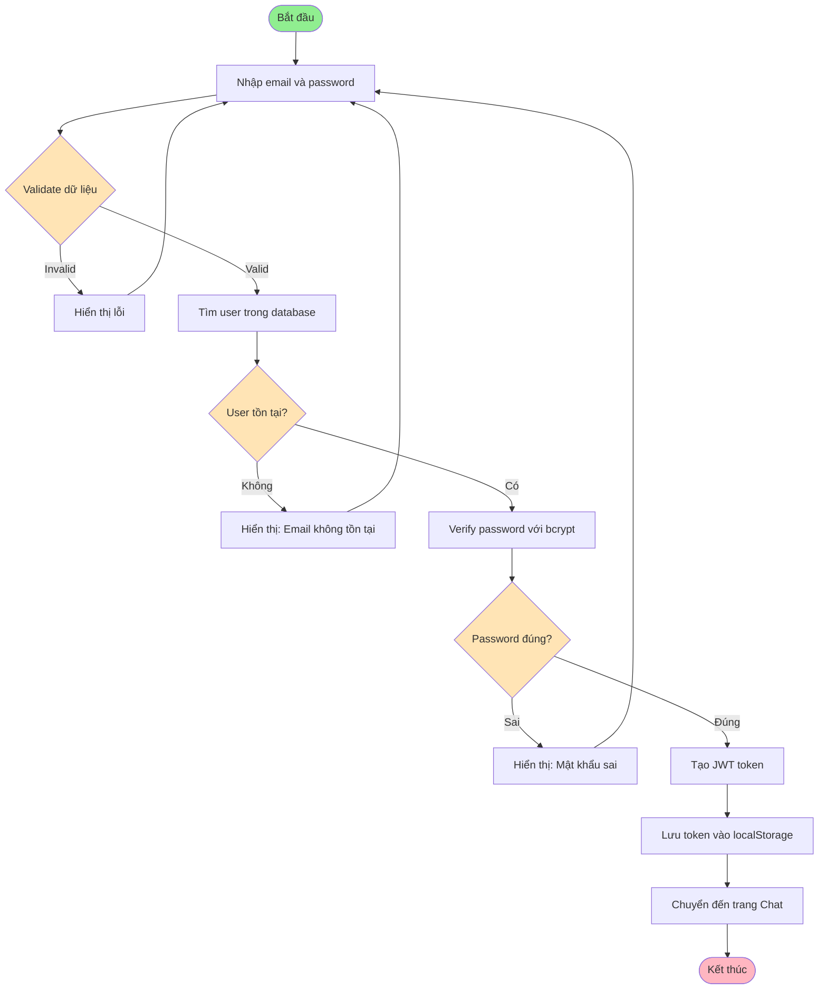
```mermaid
flowchart TD
    Start([Bắt đầu]) --> Input[Nhập email và password]
    Input --> Validate{Validate dữ liệu}
    Validate -->|Invalid| ShowError[Hiển thị lỗi]
    ShowError --> Input
    Validate -->|Valid| CheckUser[Tìm user trong database]
    CheckUser --> UserExists{User tồn tại?}
    UserExists -->|Không| ShowError2[Hiển thị: Email không tồn tại]
    ShowError2 --> Input
    UserExists -->|Có| VerifyPassword[Verify password với bcrypt]
    VerifyPassword --> PasswordCorrect{Password đúng?}
    PasswordCorrect -->|Sai| ShowError3[Hiển thị: Mật khẩu sai]
    ShowError3 --> Input
    PasswordCorrect -->|Đúng| GenerateToken[Tạo JWT token]
    GenerateToken --> SaveToken[Lưu token vào localStorage]
    SaveToken --> Redirect[Chuyển đến trang Chat]
    Redirect --> End([Kết thúc])
    
    style Start fill:#90EE90
    style End fill:#FFB6C1
    style Validate fill:#FFE4B5
    style UserExists fill:#FFE4B5
    style PasswordCorrect fill:#FFE4B5
```

**Hình 2.8 Biểu đồ hoạt động chức năng đăng nhập**

### 2.3.2 Biểu đồ hoạt động Chat with AI

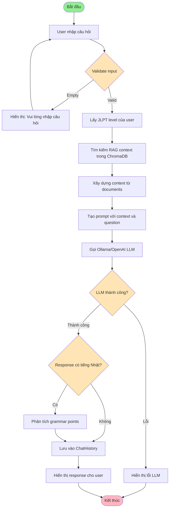
```mermaid
flowchart TD
    Start([Bắt đầu]) --> Input[User nhập câu hỏi]
    Input --> Validate{Validate input}
    Validate -->|Empty| ShowError[Hiển thị: Vui lòng nhập câu hỏi]
    ShowError --> Input
    Validate -->|Valid| GetUserJLPT[Lấy JLPT level của user]
    GetUserJLPT --> RAGSearch[Tìm kiếm RAG context trong ChromaDB]
    RAGSearch --> BuildContext[Xây dựng context từ documents]
    BuildContext --> BuildPrompt[Tạo prompt với context và question]
    BuildPrompt --> CallLLM[Gọi Ollama/OpenAI LLM]
    CallLLM --> LLMSuccess{LLM thành công?}
    LLMSuccess -->|Lỗi| ShowError2[Hiển thị lỗi LLM]
    ShowError2 --> End([Kết thúc])
    LLMSuccess -->|Thành công| ExtractGrammar{Response có tiếng Nhật?}
    ExtractGrammar -->|Có| AnalyzeGrammar[Phân tích grammar points]
    ExtractGrammar -->|Không| SaveHistory
    AnalyzeGrammar --> SaveHistory[Lưu vào ChatHistory]
    SaveHistory --> DisplayResponse[Hiển thị response cho user]
    DisplayResponse --> End
    
    style Start fill:#90EE90
    style End fill:#FFB6C1
    style Validate fill:#FFE4B5
    style LLMSuccess fill:#FFE4B5
    style ExtractGrammar fill:#FFE4B5
```

**Hình 2.9 Biểu đồ hoạt động Chat with AI**

### 2.3.3 Biểu đồ hoạt động Grammar Analysis

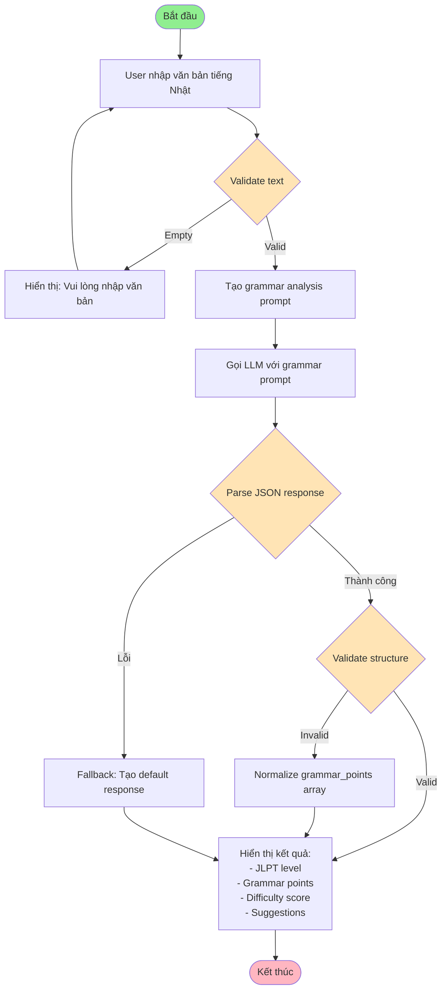
```mermaid
flowchart TD
    Start([Bắt đầu]) --> Input[User nhập văn bản tiếng Nhật]
    Input --> Validate{Validate text}
    Validate -->|Empty| ShowError[Hiển thị: Vui lòng nhập văn bản]
    ShowError --> Input
    Validate -->|Valid| BuildPrompt[Tạo grammar analysis prompt]
    BuildPrompt --> CallLLM[Gọi LLM với grammar prompt]
    CallLLM --> ParseJSON{Parse JSON response}
    ParseJSON -->|Lỗi| Fallback[Fallback: Tạo default response]
    ParseJSON -->|Thành công| ValidateStructure{Validate structure}
    ValidateStructure -->|Invalid| Normalize[Normalize grammar_points array]
    ValidateStructure -->|Valid| DisplayResults
    Normalize --> DisplayResults[Hiển thị kết quả:<br/>- JLPT level<br/>- Grammar points<br/>- Difficulty score<br/>- Suggestions]
    Fallback --> DisplayResults
    DisplayResults --> End([Kết thúc])
    
    style Start fill:#90EE90
    style End fill:#FFB6C1
    style Validate fill:#FFE4B5
    style ParseJSON fill:#FFE4B5
    style ValidateStructure fill:#FFE4B5
```

**Hình 2.10 Biểu đồ hoạt động Grammar Analysis**

### 2.3.4 Biểu đồ hoạt động Add Document

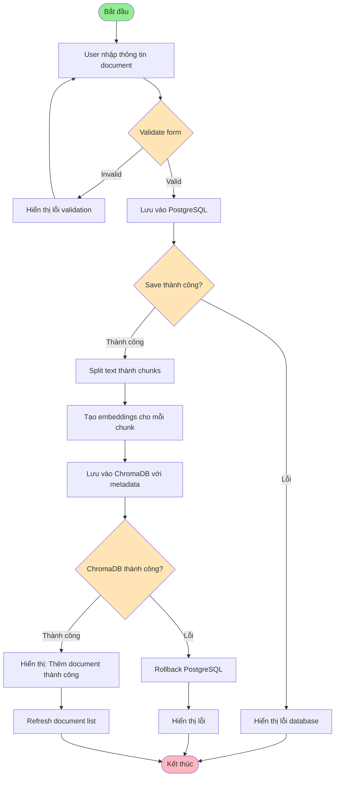
```mermaid
flowchart TD
    Start([Bắt đầu]) --> Input[User nhập thông tin document]
    Input --> Validate{Validate form}
    Validate -->|Invalid| ShowError[Hiển thị lỗi validation]
    ShowError --> Input
    Validate -->|Valid| SavePostgreSQL[Lưu vào PostgreSQL]
    SavePostgreSQL --> SaveSuccess{Save thành công?}
    SaveSuccess -->|Lỗi| ShowError2[Hiển thị lỗi database]
    ShowError2 --> End([Kết thúc])
    SaveSuccess -->|Thành công| SplitText[Split text thành chunks]
    SplitText --> GenerateEmbeddings[Tạo embeddings cho mỗi chunk]
    GenerateEmbeddings --> SaveChromaDB[Lưu vào ChromaDB với metadata]
    SaveChromaDB --> ChromaSuccess{ChromaDB thành công?}
    ChromaSuccess -->|Lỗi| Rollback[Rollback PostgreSQL]
    Rollback --> ShowError3[Hiển thị lỗi]
    ShowError3 --> End
    ChromaSuccess -->|Thành công| ShowSuccess[Hiển thị: Thêm document thành công]
    ShowSuccess --> RefreshList[Refresh document list]
    RefreshList --> End
    
    style Start fill:#90EE90
    style End fill:#FFB6C1
    style Validate fill:#FFE4B5
    style SaveSuccess fill:#FFE4B5
    style ChromaSuccess fill:#FFE4B5
```

**Hình 2.11 Biểu đồ hoạt động Add Document**

---

## 2.4 Biểu đồ trình tự (Sequence Diagram)

### 2.4.1 Biểu đồ trình tự đăng nhập

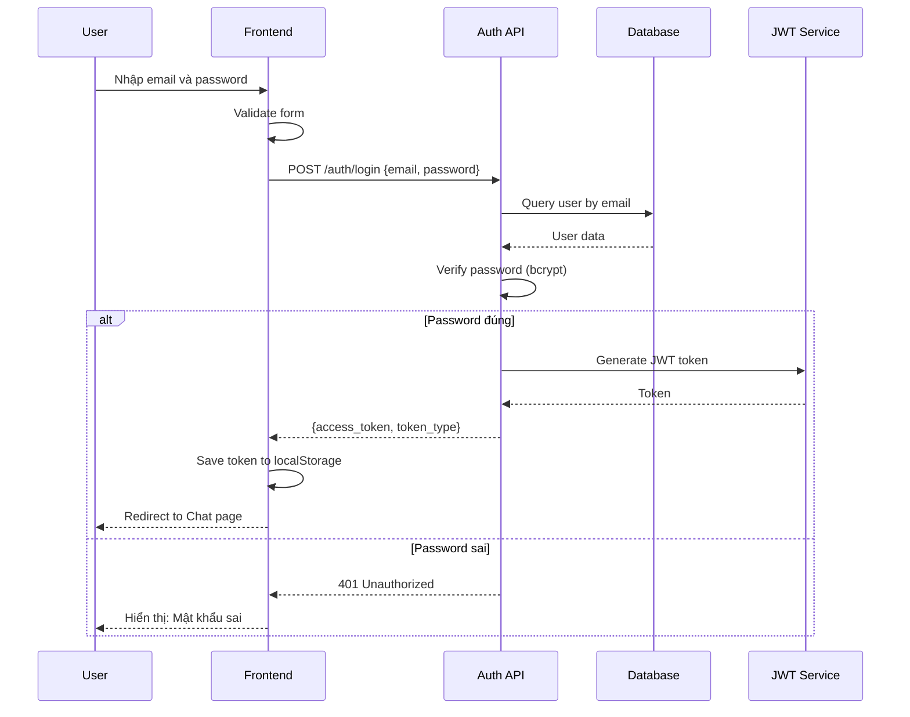
```mermaid
sequenceDiagram
    participant U as User
    participant F as Frontend
    participant A as Auth API
    participant DB as Database
    participant JWT as JWT Service
    
    U->>F: Nhập email và password
    F->>F: Validate form
    F->>A: POST /auth/login {email, password}
    A->>DB: Query user by email
    DB-->>A: User data
    A->>A: Verify password (bcrypt)
    alt Password đúng
        A->>JWT: Generate JWT token
        JWT-->>A: Token
        A-->>F: {access_token, token_type}
        F->>F: Save token to localStorage
        F-->>U: Redirect to Chat page
    else Password sai
        A-->>F: 401 Unauthorized
        F-->>U: Hiển thị: Mật khẩu sai
    end
```

**Hình 2.12 Biểu đồ trình tự đăng nhập**

### 2.4.2 Biểu đồ trình tự Chat with AI

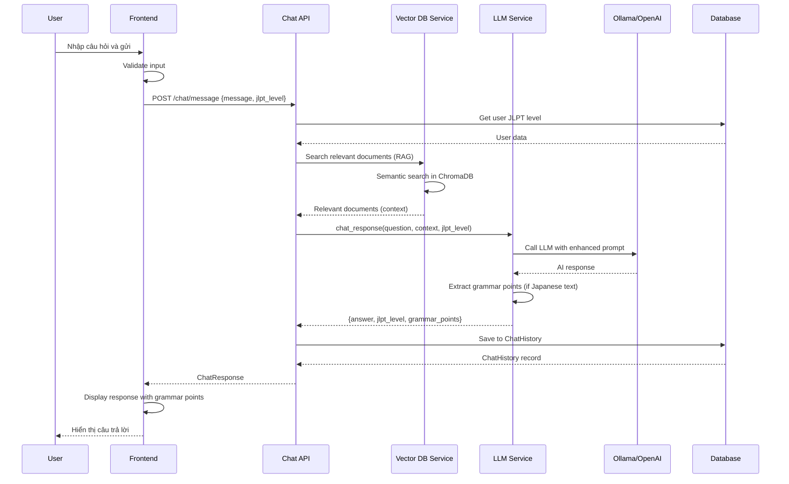
```mermaid
sequenceDiagram
    participant U as User
    participant F as Frontend
    participant C as Chat API
    participant VS as Vector DB Service
    participant LLM as LLM Service
    participant O as Ollama/OpenAI
    participant DB as Database
    
    U->>F: Nhập câu hỏi và gửi
    F->>F: Validate input
    F->>C: POST /chat/message {message, jlpt_level}
    C->>DB: Get user JLPT level
    DB-->>C: User data
    C->>VS: Search relevant documents (RAG)
    VS->>VS: Semantic search in ChromaDB
    VS-->>C: Relevant documents (context)
    C->>LLM: chat_response(question, context, jlpt_level)
    LLM->>O: Call LLM with enhanced prompt
    O-->>LLM: AI response
    LLM->>LLM: Extract grammar points (if Japanese text)
    LLM-->>C: {answer, jlpt_level, grammar_points}
    C->>DB: Save to ChatHistory
    DB-->>C: ChatHistory record
    C-->>F: ChatResponse
    F->>F: Display response with grammar points
    F-->>U: Hiển thị câu trả lời
```

**Hình 2.13 Biểu đồ trình tự Chat with AI**

### 2.4.3 Biểu đồ trình tự Grammar Analysis

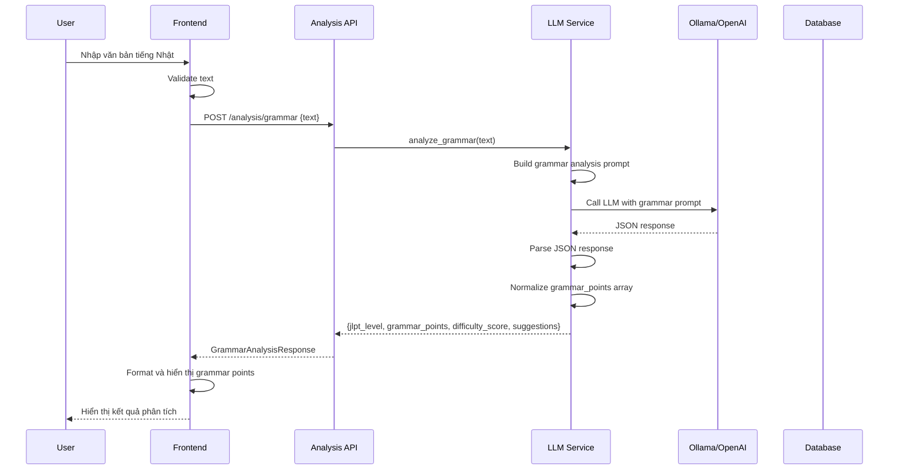
```mermaid
sequenceDiagram
    participant U as User
    participant F as Frontend
    participant A as Analysis API
    participant LLM as LLM Service
    participant O as Ollama/OpenAI
    participant DB as Database
    
    U->>F: Nhập văn bản tiếng Nhật
    F->>F: Validate text
    F->>A: POST /analysis/grammar {text}
    A->>LLM: analyze_grammar(text)
    LLM->>LLM: Build grammar analysis prompt
    LLM->>O: Call LLM with grammar prompt
    O-->>LLM: JSON response
    LLM->>LLM: Parse JSON response
    LLM->>LLM: Normalize grammar_points array
    LLM-->>A: {jlpt_level, grammar_points, difficulty_score, suggestions}
    A-->>F: GrammarAnalysisResponse
    F->>F: Format và hiển thị grammar points
    F-->>U: Hiển thị kết quả phân tích
```

**Hình 2.14 Biểu đồ trình tự Grammar Analysis**

### 2.4.4 Biểu đồ trình tự Add Document

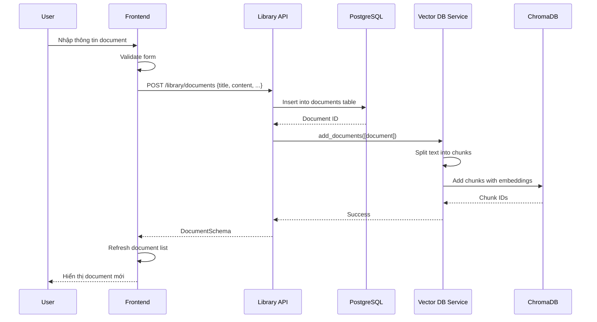
```mermaid
sequenceDiagram
    participant U as User
    participant F as Frontend
    participant L as Library API
    participant DB as PostgreSQL
    participant VS as Vector DB Service
    participant CDB as ChromaDB
    
    U->>F: Nhập thông tin document
    F->>F: Validate form
    F->>L: POST /library/documents {title, content, ...}
    L->>DB: Insert into documents table
    DB-->>L: Document ID
    L->>VS: add_documents([document])
    VS->>VS: Split text into chunks
    VS->>CDB: Add chunks with embeddings
    CDB-->>VS: Chunk IDs
    VS-->>L: Success
    L-->>F: DocumentSchema
    F->>F: Refresh document list
    F-->>U: Hiển thị document mới
```

**Hình 2.15 Biểu đồ trình tự Add Document**

---

## 2.5 Biểu đồ trạng thái (State Diagram)

### 2.5.1 Biểu đồ trạng thái đăng nhập

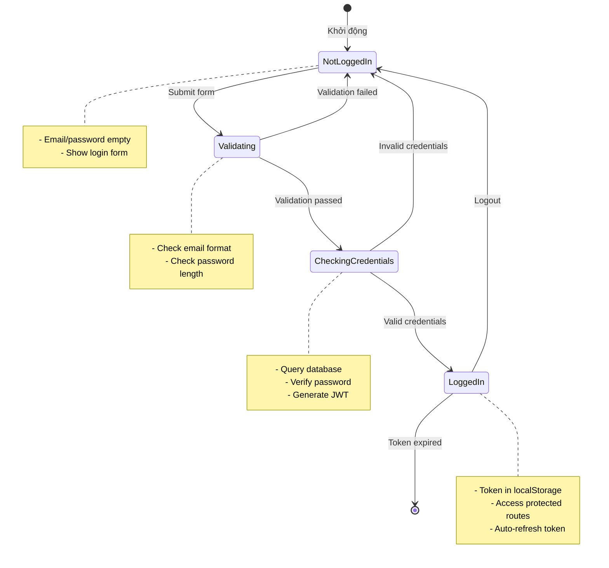
```mermaid
stateDiagram-v2
    [*] --> NotLoggedIn: Khởi động
    NotLoggedIn --> Validating: Submit form
    Validating --> NotLoggedIn: Validation failed
    Validating --> CheckingCredentials: Validation passed
    CheckingCredentials --> NotLoggedIn: Invalid credentials
    CheckingCredentials --> LoggedIn: Valid credentials
    LoggedIn --> NotLoggedIn: Logout
    LoggedIn --> [*]: Token expired
    
    note right of NotLoggedIn
        - Email/password empty
        - Show login form
    end note
    
    note right of Validating
        - Check email format
        - Check password length
    end note
    
    note right of CheckingCredentials
        - Query database
        - Verify password
        - Generate JWT
    end note
    
    note right of LoggedIn
        - Token in localStorage
        - Access protected routes
        - Auto-refresh token
    end note
```

**Hình 2.16 Biểu đồ trạng thái đăng nhập**

### 2.5.2 Biểu đồ trạng thái Chat Message

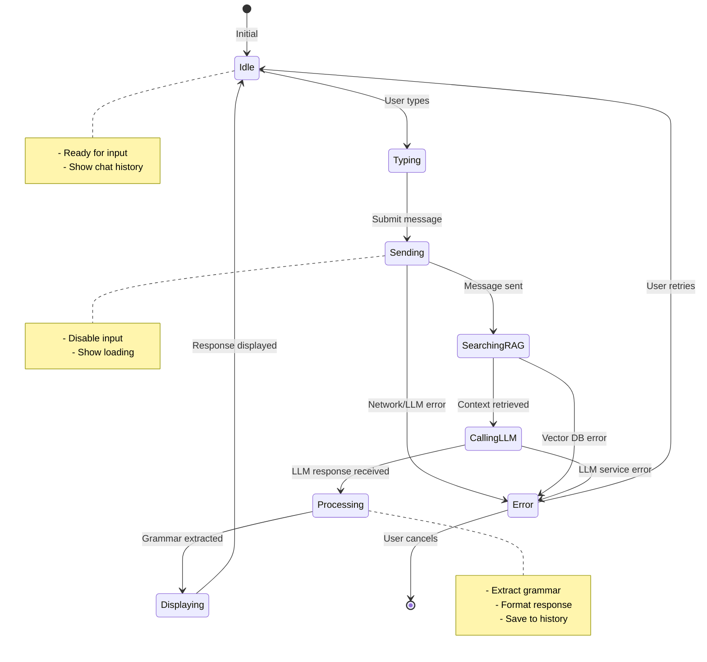
```mermaid
stateDiagram-v2
    [*] --> Idle: Initial
    Idle --> Typing: User types
    Typing --> Sending: Submit message
    Sending --> SearchingRAG: Message sent
    SearchingRAG --> CallingLLM: Context retrieved
    CallingLLM --> Processing: LLM response received
    Processing --> Displaying: Grammar extracted
    Displaying --> Idle: Response displayed
    Sending --> Error: Network/LLM error
    SearchingRAG --> Error: Vector DB error
    CallingLLM --> Error: LLM service error
    Error --> Idle: User retries
    Error --> [*]: User cancels
    
    note right of Idle
        - Ready for input
        - Show chat history
    end note
    
    note right of Sending
        - Disable input
        - Show loading
    end note
    
    note right of Processing
        - Extract grammar
        - Format response
        - Save to history
    end note
```

**Hình 2.17 Biểu đồ trạng thái Chat Message**

### 2.5.3 Biểu đồ trạng thái Document

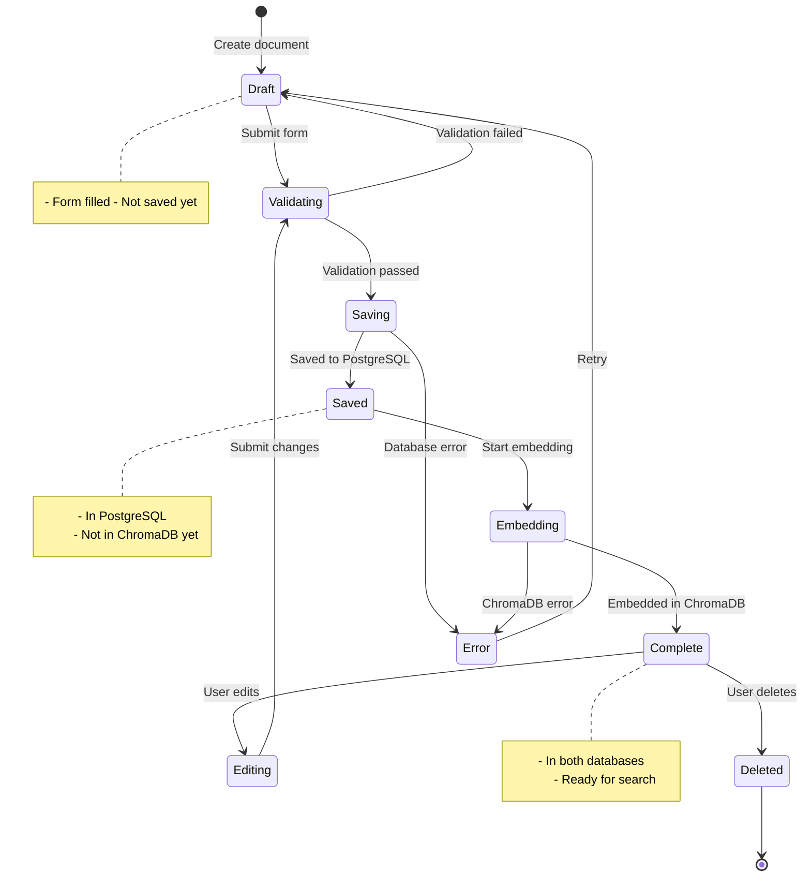
```mermaid
stateDiagram-v2
    [*] --> Draft: Create document
    Draft --> Validating: Submit form
    Validating --> Draft: Validation failed
    Validating --> Saving: Validation passed
    Saving --> Saved: Saved to PostgreSQL
    Saved --> Embedding: Start embedding
    Embedding --> Complete: Embedded in ChromaDB
    Saving --> Error: Database error
    Embedding --> Error: ChromaDB error
    Error --> Draft: Retry
    Complete --> Editing: User edits
    Editing --> Validating: Submit changes
    Complete --> Deleted: User deletes
    Deleted --> [*]
    
    note right of Draft
        - Form filled
        - Not saved yet
    end note
    
    note right of Saved
        - In PostgreSQL
        - Not in ChromaDB yet
    end note
    
    note right of Complete
        - In both databases
        - Ready for search
    end note
```

**Hình 2.18 Biểu đồ trạng thái Document**

---

## 2.6 Biểu đồ thành phần (Component Diagram)

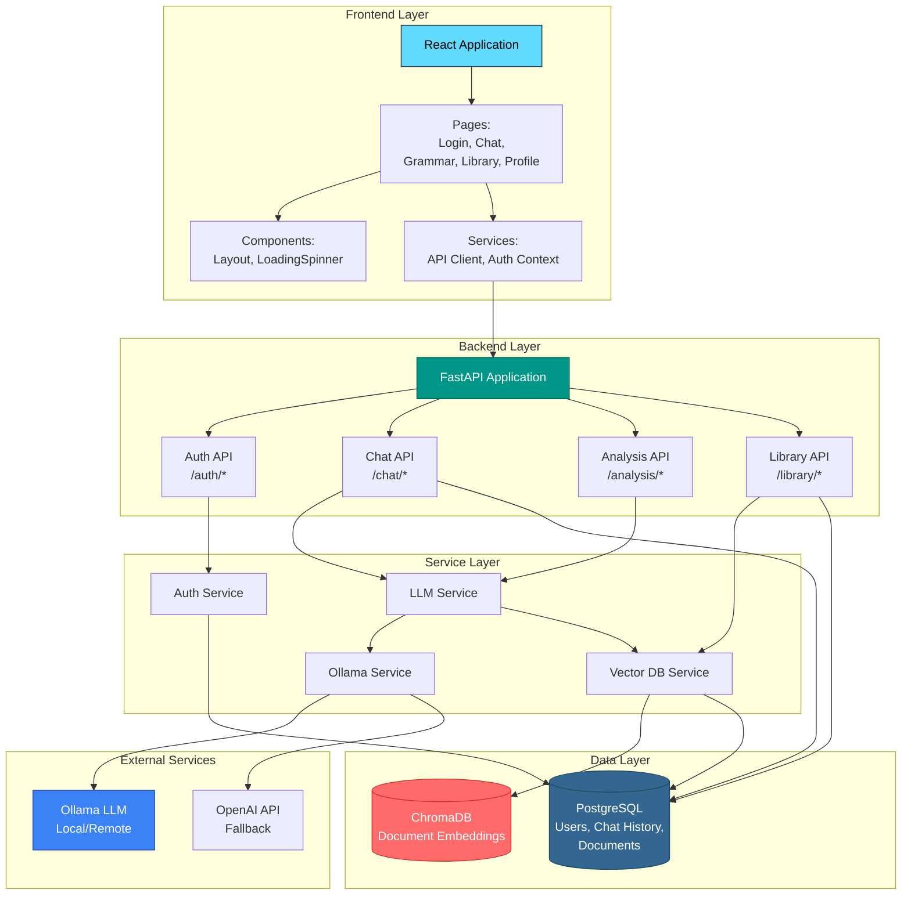
```mermaid
graph TB
    subgraph "Frontend Layer"
        React[React Application]
        Pages[Pages:<br/>Login, Chat,<br/>Grammar, Library, Profile]
        Components[Components:<br/>Layout, LoadingSpinner]
        Services[Services:<br/>API Client, Auth Context]
    end
    
    subgraph "Backend Layer"
        FastAPI[FastAPI Application]
        AuthAPI[Auth API<br/>/auth/*]
        ChatAPI[Chat API<br/>/chat/*]
        AnalysisAPI[Analysis API<br/>/analysis/*]
        LibraryAPI[Library API<br/>/library/*]
    end
    
    subgraph "Service Layer"
        AuthService[Auth Service]
        LLMService[LLM Service]
        OllamaService[Ollama Service]
        VectorDBService[Vector DB Service]
    end
    
    subgraph "Data Layer"
        PostgreSQL[(PostgreSQL<br/>Users, Chat History,<br/>Documents)]
        ChromaDB[(ChromaDB<br/>Document Embeddings)]
    end
    
    subgraph "External Services"
        Ollama[Ollama LLM<br/>Local/Remote]
        OpenAI[OpenAI API<br/>Fallback]
    end
    
    React --> Pages
    Pages --> Components
    Pages --> Services
    Services --> FastAPI
    
    FastAPI --> AuthAPI
    FastAPI --> ChatAPI
    FastAPI --> AnalysisAPI
    FastAPI --> LibraryAPI
    
    AuthAPI --> AuthService
    ChatAPI --> LLMService
    AnalysisAPI --> LLMService
    LibraryAPI --> VectorDBService
    
    LLMService --> OllamaService
    LLMService --> VectorDBService
    OllamaService --> Ollama
    OllamaService --> OpenAI
    
    AuthService --> PostgreSQL
    ChatAPI --> PostgreSQL
    LibraryAPI --> PostgreSQL
    VectorDBService --> ChromaDB
    VectorDBService --> PostgreSQL
    
    style React fill:#61DAFB,stroke:#20232A,color:#000
    style FastAPI fill:#009688,stroke:#004D40,color:#fff
    style PostgreSQL fill:#336791,stroke:#1A4A5C,color:#fff
    style ChromaDB fill:#FF6B6B,stroke:#C92A2A,color:#fff
    style Ollama fill:#3B82F6,stroke:#1E40AF,color:#fff
```

**Hình 2.19 Biểu đồ thành phần**

### Mô tả các thành phần:

#### Frontend Layer
- **React Application**: Ứng dụng React chính với routing và state management
- **Pages**: Các trang chính (Login, Chat, Grammar, Library, Profile)
- **Components**: Các component tái sử dụng (Layout, LoadingSpinner)
- **Services**: API client và authentication context

#### Backend Layer
- **FastAPI Application**: Ứng dụng FastAPI với CORS và middleware
- **Auth API**: Xử lý authentication (register, login, profile)
- **Chat API**: Xử lý chat messages và history
- **Analysis API**: Xử lý grammar analysis, translation, JLPT prediction
- **Library API**: Xử lý quản lý tài liệu học tập

#### Service Layer
- **Auth Service**: Business logic cho authentication
- **LLM Service**: Abstraction layer cho LLM operations
- **Ollama Service**: Tương tác với Ollama LLM
- **Vector DB Service**: Quản lý ChromaDB cho RAG

#### Data Layer
- **PostgreSQL**: Relational database cho users, chat history, documents
- **ChromaDB**: Vector database cho document embeddings

#### External Services
- **Ollama**: Local LLM runtime (primary)
- **OpenAI**: Cloud LLM API (fallback)

---

## 2.7 Biểu đồ triển khai (Deployment Diagram)

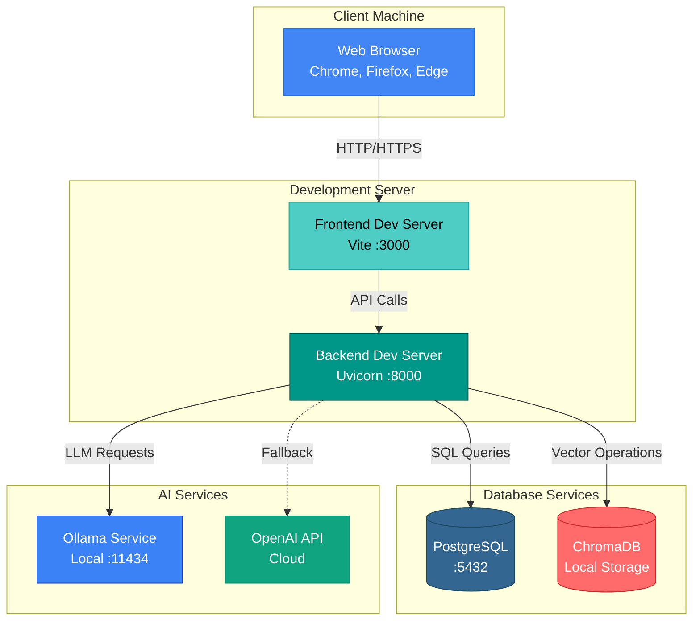
```mermaid
graph TB
    subgraph "Client Machine"
        Browser[Web Browser<br/>Chrome, Firefox, Edge]
    end
    
    subgraph "Development Server"
        FrontendDev[Frontend Dev Server<br/>Vite :3000]
        BackendDev[Backend Dev Server<br/>Uvicorn :8000]
    end
    
    subgraph "Database Services"
        PostgreSQL[(PostgreSQL<br/>:5432)]
        ChromaDB[(ChromaDB<br/>Local Storage)]
    end
    
    subgraph "AI Services"
        OllamaLocal[Ollama Service<br/>Local :11434]
        OpenAIAPI[OpenAI API<br/>Cloud]
    end
    
    Browser -->|HTTP/HTTPS| FrontendDev
    FrontendDev -->|API Calls| BackendDev
    BackendDev -->|SQL Queries| PostgreSQL
    BackendDev -->|Vector Operations| ChromaDB
    BackendDev -->|LLM Requests| OllamaLocal
    BackendDev -.->|Fallback| OpenAIAPI
    
    style Browser fill:#4285F4,stroke:#1A73E8,color:#fff
    style FrontendDev fill:#4ECDC4,stroke:#26A69A,color:#000
    style BackendDev fill:#009688,stroke:#004D40,color:#fff
    style PostgreSQL fill:#336791,stroke:#1A4A5C,color:#fff
    style ChromaDB fill:#FF6B6B,stroke:#C92A2A,color:#fff
    style OllamaLocal fill:#3B82F6,stroke:#1E40AF,color:#fff
    style OpenAIAPI fill:#10A37F,stroke:#0D8E6E,color:#fff
```

**Hình 2.20 Biểu đồ triển khai**

### Mô tả triển khai:

#### Client Machine
- **Web Browser**: Người dùng truy cập ứng dụng qua trình duyệt web

#### Development Server
- **Frontend Dev Server**: Vite development server chạy trên port 3000
- **Backend Dev Server**: Uvicorn ASGI server chạy trên port 8000

#### Database Services
- **PostgreSQL**: Relational database chạy trên port 5432 (có thể trong Docker)
- **ChromaDB**: Vector database lưu trữ local trong thư mục `./chroma_db`

#### AI Services
- **Ollama Service**: Local LLM service chạy trên port 11434 (primary)
- **OpenAI API**: Cloud-based LLM service (fallback khi Ollama không khả dụng)

---

## 2.8 Tóm tắt

Hệ thống SenpaiAI được thiết kế với kiến trúc 3 tầng rõ ràng:

1. **Presentation Layer (Frontend)**: React + TypeScript + TailwindCSS
2. **Business Logic Layer (Backend)**: FastAPI + Python
3. **Data Layer**: PostgreSQL (relational) + ChromaDB (vector)

Các biểu đồ UML trên mô tả đầy đủ:
- **Use Cases**: 12 use cases chính cho người dùng
- **Class Diagram**: 8 lớp chính với quan hệ rõ ràng
- **Activity Diagrams**: Luồng xử lý cho các chức năng quan trọng
- **Sequence Diagrams**: Tương tác giữa các thành phần
- **State Diagrams**: Trạng thái của các đối tượng chính
- **Component Diagram**: Cấu trúc thành phần hệ thống
- **Deployment Diagram**: Triển khai và môi trường

Hệ thống sử dụng công nghệ AI hiện đại (LLM + RAG) để cung cấp trải nghiệm học tiếng Nhật tương tác và hiệu quả.

